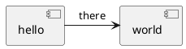

Recentemente eu decidi começar a escrever usando apenas o [Obsidian](https://obsidian.md/), além de ter vários plugins interessantes, ele usa markdown e principalmente, tem uma filosofia de conexão entre as notas que me pareceu muito interessante.

Ao mesmo tempo, eu gostaria de poder reunir tudo que faço em um mesmo lugar,  e apesar de continuar usando vários cadernos, é no Obsidian que eu passo a limpo as anotações, categorizo e organizo tudo (a parte da organização ainda está sendo trabalhada). Com isso, surgiu a ideia de poder usar o obsidian para publicar no blog, que é feito no Medium e conectado ao meu site.

## O projeto

Ser capaz de escrever, rodar um script e ver tudo sincronizado nos locais que eu gostaria me pareceu interessante do ponto de vista de desenvolvimento, e mesmo que exista ferramentas que já fazem isso, achei que seria um bom exercício fazer esse processamento e integração.

Muitas das coisas que eu escrevo são técnicas, o que significa que um suporte para blocos de códigos e algumas vezes equações é bastante importante, e pela minha experiência o Medium não é muito bom para lidar com esse tipo de conteúdo.

Por isso, em primeira linha a arquitetura do projeto deveria ser algo como:



Com essa sequência de processamento, os artigos que eu escrevo devem ser capazes de chegar até o Medium com as imagens e equações formatadas de maneira consistente e bem apresentada.

### Trabalhando com equações

Um dos problemas ao escrever conteúdo matemático no Medium é o fato de que não é possível utilizar bibliotecas para a interpretação de códigos matemáticos, como MathJax. Para resolver esse problema, encontrei sites e indicações de lugares que fazema conversão de equações em mathml ou LaTex para imagem, e decidi utilizar o mathjax com node para esse fim. A sequência de transformação feita desse modo:

[INSERIR GRÁFICO]

#### Equações no texto

Nos casos em uma equação é escrita no meio do texto, não é possível a conversão do texto em imagem, uma vez que a imagen não poderá ser utilizada na mesma linha com o Medium.

Por isso, para este tipo de equação, utilizei uma biblioteca que faz o mapeamento de códigos TeX para os símbolos matemáticos unicode, que é interpretado como qualquer outro texto pelo browser. Isso possibilita por exemplo que o texto 'P = {(I_i, I_j) | I_i \cap I_j = \emptyset}' seja visualizado como a equação 
<equation>P = {(I_i, I_j) | I_i \cap I_j = \emptyset}</equation>


Other inline <equation>P = {(I_i, I_j) | I_i \cap I_j = \emptyset}</equation>

```latex
    x=\frac{ -b\pm\sqrt{ b^2-4ac } } {2a}
    x=\frac{ -b\pm\sqrt{ b^2-4ac } } {2a}
    x=\frac{ -b\pm\sqrt{ b^2-4ac } } {2a}
```

## Blocos de código

```js
    var test = "string"

    console.log('Code rendering test')
```
